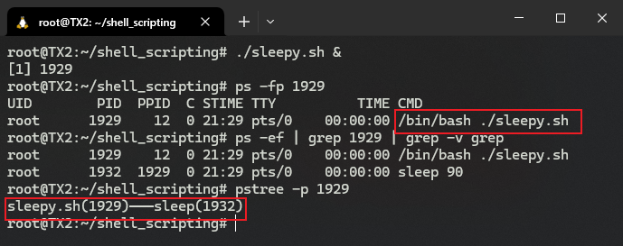

# S02：Shell Scripting, Succinctly


## 1 本章要求（L03）

- 本章关于 Shell 脚本的两节视频课（L04、L05）是 Shell 脚本的核心知识，后续章节都将基于本章知识点进行补充拓展，因此必须彻底掌握方可继续；
- L04、L05 要求至少各学两遍；
- 本章还将介绍一些与 Shell 脚本相关但不展开讨论的内容，有助于熟悉 Shell 脚本的应用场景；
- 可结合与本课附带的 Shell 脚本速查表（PDF 精修版）加深相关知识点的理解。


## 2 Shell 脚本（一）（L04）

> 本节要点
>
> - 脚本的概念
> - 脚本的组成部分
> - 变量在脚本中的用法
> - 脚本中的条件判定与流程控制
> - 命令行参数的接收方法
> - 用户输入内容的接收方法

### 2.1 脚本的概念

主要特点：

- 包含一组命令；
- 这些命令由解释器（interpreter，在 Shell 脚本语境下，即 Shell 自身）负责处理与执行；
- 能在命令行输入的任何内容都可以放到某个脚本中执行；
- 常用于任务的自动化。

例如脚本文件 `script.sh`：

```shell
#!/bin/bash
echo "Scripting is fun!"
```

运行情况如下：


### 2.2 关于 shebang

示例脚本中的数字符号 `#` 与音乐中的升调符号类似，读作 `sharp`（即 `/ʃɑːp/`）；而感叹号 `!` 也有人读作 `/bæŋ/`。因此 `#!` 连起来可以读作 `/ˈʃɑːpˈbæn/`，而平时常见的 `shebang`（`/ʃɪˈbæŋ/`）则是 `sharp bang` 的非标准缩略形式。

`shebang` 的后面要紧跟一个解释器的路径，表示使用该路径对应的解释器来执行这段 Shell 脚本；在执行过程中，该解释器路径 **还会作为参数传给解释器**。验证如下：

> **验证：`shebang` 标记后的解释器路径将作为参数传入该解释器**
>
> 准备一个示例脚本文件 `sleepy.sh`，实现让系统暂时休眠 90 秒：
>
> ```shell
> #!/bin/bash
> sleep 90
> ```
>
> 然后执行以下命令：
>
> ```shell
> $ ./sleepy.sh &
> [1] 1929
> $ ps -fp 1929
> UID        PID  PPID  C STIME TTY          TIME CMD
> root      1929    12  0 21:29 pts/0    00:00:00 /bin/bash ./sleepy.sh
> ```
>
> 可以看到最后一行末尾显示的完整命令为 `/bin/bash ./sleepy.sh`。
>
> 此外，还可以进一步查看该进程号，看到当前有且仅有一个被执行的命令 `sleep 90`：
>
> ```shell
> $ ps -ef | grep 1929 | grep -v grep
> root      1929    12  0 21:29 pts/0    00:00:00 /bin/bash ./sleepy.sh
> root      1932  1929  0 21:29 pts/0    00:00:00 sleep 90
> $ pstree -p 1929
> sleepy.sh(1929)───sleep(1932)
> ```
>
> 实测情况（`WSL` 环境下）：
>
> 

如果不写 `shebang` 这行，解释器将使用当前默认的 `Bash Shell`，执行过程中可能因语法不同而出错。因此最好不要抱侥幸心理。

> [!tip]
>
> **注意：解释器路径可能未必是 Bash Shell**
>
> 如题，该路径也可以是其他完全不同的解释器的，例如 `Python` 解释器——
>
> 依次执行以下命令，创建一个可执行的 `Python` 脚本文件 `hi.py`：
>
> ```shell
> $ touch hi.py
> $ chmod 755 hi.py
> $ vim hi.py
> $ ./hi.py
> ```
>
> 其中 `hi.py` 的代码如下：
>
> ```python
> #!/usr/bin/python
> """
> This is a demo for different interpreter path on shebang line
> """
> print("This is a Python script.")
> ```
>
> 实际运行结果：
>
> 


### 2.3 变量

Shell 脚本中的变量可以简单理解成一个具有名称的存储位置。它是以 **名值对（name-value pair）**的形式定义的，具体语法如下：

```shell
VARIABLE_NAME="value"
```

注意：

1. 等号的两边 **不能出现空格或任何空白符号**；
2. 变量名 **区分大小写**；
3. 变量名最佳实践：统一使用 **全大写+下划线** 形式；
4. 调用变量时，使用 `$VARIABLE_NAME` 或 `${VARIABLE_NAME}`，后者用于分隔紧跟在变量名后面的其他内容。

例如：

```shell
#!/bin/bash
MY_SHELL="bash"
echo "I am $MY_SHELLing on my keyboard."
echo "I am ${MY_SHELL}ing on my keyboard."

# 结果：
# I am  on my keyboard.
# I am bashing on my keyboard.
```


#### 2.3.1 将命令执行结果赋给某个变量

具体写法（第 2 行）：

```shell
#!/bin/bash
SERVER_NAME=$(hostname)
echo "You are running this script on ${SERVER_NAME}."

# 结果：
# You are running this script on TX2.
```

还有一种过时的老版本写法，用的是反引号：

```shell
SERVER_NAME=`hostname`
```


#### 2.3.2 变量名的命名规范

有效的变量名只能包含大小字母、数字和下划线，且不能以数字开头。


### 2.4 条件判定

语法：

```shell
[ condition-to-test-for ]
```

例如判定文件是否存在：

```shell
[ -e /etc/passwd ]
```

存在，则返回 `true`，此时返回码为 `0`；否则返回 `false`，对应返回码 `1`。


#### 2.4.1 常见的条件判定操作符

文件操作符：

|  操作符   | 含义                                 |
| :-------: | ------------------------------------ |
| `-d FILE` | `FILE` 为某个目录，返回 `true`       |
| `-e FILE` | `FILE` 存在，返回 `true`             |
| `-f FILE` | `FILE` 存在且为普通文件，返回 `true` |
| `-s FILE` | `FILE` 存在且非空，返回 `true` [^1]  |
| `-r FILE` | `FILE` 当前可读，返回 `true`         |
| `-w FILE` | `FILE` 当前可写，返回 `true`         |
| `-x FILE` | `FILE` 当前可执行，返回 `true`       |

字符串操作符：

|        操作符        | 含义                                       |
| :------------------: | ------------------------------------------ |
|     `-z STRING`      | `STRING` 为空，返回 `true`                 |
|     `-n STRING`      | `STRING` 非空，返回 `true`                 |
| `STRING1 = STRING2`  | `STRING1` 与 `STRING2` 相等，返回 `true`   |
| `STRING1 != STRING2` | `STRING1` 与 `STRING2` 不相等，返回 `true` |

算术操作符：

|     操作符      | 含义                                  |
| :-------------: | ------------------------------------- |
| `arg1 -eq arg2` | `arg1` 等于 `arg2`，返回 `true`       |
| `arg1 -ne arg2` | `arg1` 不等于 `arg2`，返回 `true`     |
| `arg1 -lt arg2` | `arg1` 小于 `arg2`，返回 `true`       |
| `arg1 -le arg2` | `arg1` 小于或等于 `arg2`，返回 `true` |
| `arg1 -gt arg2` | `arg1` 大于 `arg2`，返回 `true`       |
| `arg1 -ge arg2` | `arg1` 大于或等于 `arg2`，返回 `true` |

更多判定条件的写法，运行 `help test` 或者 `man test | less` 查看具体文档。


## 3 Shell 脚本（二）（L05）

### 3.1 流程控制—— if 语句

#### 语法1：普通型

```shell
if [ condition-is-true ]
then
  command 1
  command 2
  command N
fi
```

注意：方括号内部与判定条件之间至少要有一个空格，否则报错。例如：

```shell
#!/bin/bash
MY_SHELL="bash"

if [ "$MY_SHELL" = "bash" ]
then
  echo "You seem to like the bash shell."
fi

# Output:
# You seem to like the bash shell.
```

最佳实践：在进行条件判定时，要用引号包裹变量，以免出现意外情况。例如，运行以下测试脚本 `test.sh`：

```shell
#!/bin/bash
NAME="John Doe"

if [ $NAME = "John Doe" ]; then
    echo "Hello, John!"
fi

# Output:
# ./test.sh: line 4: [: too many arguments
```


#### 语法2：`if/else` 型

```shell
if [ condition-is-true ]
then
  command N
else
  command N
fi
```

例如：

```shell
#!/bin/bash
MY_SHELL="csh"

if [ "$MY_SHELL" = "bash" ]
then
  echo "You seem to like the bash shell."
else
  echo "You don't seem to like the bash shell."
fi

# Output:
# You don't seem to like the bash shell.
```


#### 语法3：`if/elif/else` 型

`elif` 即表示 `else if`，语法格式如下：

```shell
if [ condition-is-true ]
then
  command N
elif [ condition-is-true ]
then
  command N
else
  command N
fi
```

例如：

```shell
#!/bin/bash
MY_SHELL="csh"

if [ "$MY_SHELL" = "bash" ]
then
  echo "You seem to like the bash shell."
elif [ "$MY_SHELL" = "csh" ]
then
  echo "You seem to like the csh shell."
else
  echo "You don't seem to like the bash or csh shell."
fi

# Output:
# You seem to like the csh shell.
```


### 3.2 流程控制—— for 循环

语法：

```shell
for VARIABLE_NAME in ITEM_1 ITEM_N
do
  command 1
  command 2
  command N
done
```

例如：

```shell
#!/bin/bash

for COLOR in red green blue
do
  echo "COLOR: $COLOR"
done

# Output:
# COLOR: red
# COLOR: green
# COLOR: blue
```

或者将列表项赋给一个变量：

```shell
#!/bin/bash
COLORS="red green blue"

for COLOR in $COLORS
do
  echo "COLOR: $COLOR"
done
```

再如，批量重命名脚本 `rename-pics.sh`：

```shell
#!/bin/bash
PICTURES=$(ls *jpg)
DATE=$(date +%F)

for PICTURE in $PICTURES
do
  echo "Renaming ${PICTURE} to ${DATE}-${PICTURE}"
  mv ${PICTURE} ${DATE}-${PICTURE}
done
```

将其放入一个图片文件夹 `pics` 内，执行以下命令：

```bash
$ mkdir pics
$ cp ./rename-pics.sh ./pics/
$ cd pics
$ touch {bear,man,pig}.jpg
$ ls
bear.jpg  man.jpg  pig.jpg  rename-pics.sh
$ ./rename-pics.sh
Renaming bear.jpg to 2025-08-23-bear.jpg
Renaming man.jpg to 2025-08-23-man.jpg
Renaming pig.jpg to 2025-08-23-pig.jpg
$ ls
2025-08-23-bear.jpg  2025-08-23-man.jpg  2025-08-23-pig.jpg  rename-pics.sh
```


### 3.3 位置参数

**位置参数（Positional Parameters）** 是一系列特殊的变量，用于接收命令行传递的参数：

```shell
$ script.sh parameter1 parameter2 parameter3
```

其位置参数如下：

- `$0`：即 `"script.sh"`
- `$1`：第一个参数 `"parameter1"`
- `$2` - 第二个参数 `"parameter2"`
- `$3` - 第三个参数 `"parameter3"`
- ...

对于参数超过 9 个的，需要使用大括号：

```shell
echo "第 10 个参数: ${10}"
echo "第 11 个参数: ${11}"
```

获取所有的位置参数，可以使用 `$@`

示例：对当前系统的某个用户数据进行存档，编写 Shell 脚本如下：

```shell
#!/bin/bash

echo "Executing script: $0"
echo "Archiving user: $1"

# Lock the account
passwd -l $1

# Create an archive of the home directory.
tar cf /archives/${1}.tar.gz /home/${1}
```

如果存在用户 `elvis`，则运行结果为：

```sh
$ ./archive_user.sh elvis
Executing script: ./archive_user.sh
Archiving user: elvis
passwd: password expiry information changed.
tar: Removing leading `/' from member names
$ 
```


扩展1：为了增强脚本的可读性，使用变量替换位置参数（L3、L6、L9、L12）：

```shell
#!/bin/bash

USER=$1 # The first parameter is the user.

echo "Executing script: $0"
echo "Archiving user: $USER"

# Lock the account
passwd -l $USER

# Create an archive of the home directory.
tar cf /archives/${USER}.tar.gz /home/${USER}
```

扩展2：如果批量处理多个用户的存档，则重构为 `$@` + `for` 循环结构：

```shell
#!/bin/bash

echo "Executing script: $0"

for USER in $@
do
  echo "Archiving user: $USER"

  # Lock the account
  passwd -l $USER

  # Create an archive of the home directory.
  tar cf /archives/${USER}.tar.gz /home/${USER}
done
```

可能的批量处理如下：

```shell
$ ./archive_user.sh chet joe
Executing script: ./archive_user.sh
Archiving user: chet
passwd: password expiry information changed.
tar: Removing leading `/' from member names
Archiving user: joe
passwd: password expiry information changed.
tar: Removing leading `/' from member names
$ 
```

实测情况（需提前创建测试用户 `chet` 和 `joe`，以及存档文件夹 `/archives`）：


### 3.4 接收用户输入（标准输入）

用户输入内容在 Shell 脚本中输入标准输入。除了用户输入外标准输入的来源还可以是命令执行结果，或者通过命令管道操作导入。

用户输入的接收通过 `read` 命令实现，语法格式为：

```shell
read -p "PROMPT" VARIABLE
```

即通过 `-p` 设置提示语，然后将输入内容赋给变量 `VARIABLE`。

再次重构用户存档脚本，将待存档用户列表改造为通过用户输入传给脚本：

```shell
#!/bin/bash

read -p "Enter a user name: " USER
echo "Archiving user: $USER"

# Lock the account
passwd -l $USER

# Create an archive of the home directory.
tar cf /archives/${USER}.tar.gz /home/${USER}
```

实测情况：


## 4 本章小结

- Shell 脚本的首行：`#!/path/to/interpreter`
- 变量的赋值：
  - `VARIABLE_NAME="value"`
  - `VARIABLE_NAME=$(command)`
- 变量的使用：
  - `$VARIBALE_NAME`
  - `${VARIBALE_NAME}`
- `if` 语句
- `for` 循环语句
- 位置参数：
  - `$0`, `$1`, `$2` ... `$9`, `${10}`
  - 所有位置参数列表：`$@`
- 注释语句：除首行的 `shebang` 外，其余位置使用 `#`
- 用户输入：使用 `read` 命令


## 5 随堂测验（quiz1）


## 6 本章习题（L06）


---

[^1]: 这里的 `s` 即 `size`，表示文件的大小：若文件存在但大小为 0，则返回 `false`；反之亦然。

