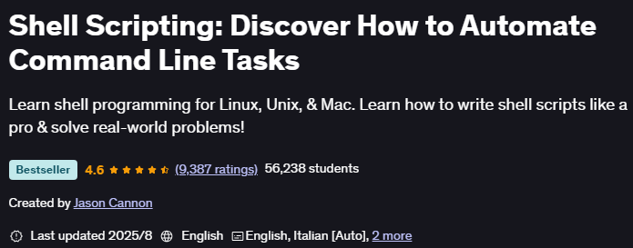

# 《Shell Scripting: Discover How to Automate Command Line Tasks》Learning Notes


## 1. Profiles



|    **Title**     | **Shell Scripting: Discover How to Automate Command Line Tasks** |
| :--------------: | :----------------------------------------------------------: |
|    **Author**    |                       **Jason Cannon**                       |
| **Publication**  |                      **Udemy, 2025.8**                       |
| **Total length** |           **14 sections \| 48 lectures \| 5h53m**            |

> ## Requirements
>
> - Some knowledge of the command line would be helpful, but not required.
>
> - Access to a Mac, Unix, or Linux computer.
>
> ## Description
>
> If you want to learn how to write shell scripts like a pro, solve real-world problems, or automate repetitive and complex tasks, read on.
>
> Hello. My name is **Jason Cannon** and I'm the author of ***Linux for Beginners***, ***Python Programming for Beginners***, and an instructor to thousands of satisfied students. I started my IT career in the late 1990's as a Unix and Linux System Engineer and I'll be sharing my real-world shell scripting and bash programming experience with you throughout this course.
>
> By the end of this course you will be able to create shell scripts with ease. You'll learn how to take tedious and repetitious tasks and turn them into programs that will save you time and simplify your life on Linux, Unix, or MAC systems.
>
> ____________________
>
> Here is what you will get and learn by taking this *Shell Scripting* course:
>
> - A step-by-step process of writing shell scripts that solve real-world problems.
>- The #1 thing you must do every time you create a shell script.
> - How to quickly find and fix the most common shell scripting errors.
>- For those of you who want to start scripting right away, watch the two video shell scripting crash course. If you do nothing else than watch these two videos you'll be ahead of most shell programmers.
> - How to accept input from a user and then make decisions on that input.
>- How to accept and process command line arguments.
> - What special variables are available, how to use them in your shell scripts, and when to do so.
> - A shell script creation check list -- You'll never have to guess what to include in each of your shell scripts again. Just use this simple check list.
> - A shell script template (boilerplate). Use this format for each of your shell scripts. It shows exactly what to include and where everything goes. Eliminate guesswork!
> - Practice exercises with solutions so you can start using what you learn right away.
> - Real-world examples of shell scripts from my personal collection.
> - A download that contains the scripts used in the presentations and lessons. You'll be able to look at and experiment with everything you're learning.
> - Quizzes after each section just to make sure you're learning the most important aspects of shell scripting.
> 
> **Learn to Program Using Any Shell**
> 
> What you learn in this course can be applied to any shell, however the focus is on the bash shell and you'll learn some really advanced bash features. Again, whether you're using bash, bourne (`sh`), KornShell (`ksh`), C shell (`csh`), Z shell (`zsh`), or even the `tcsh` shell, you'll be able to put what you learn in this course to good use.
> 
> **Perfect for Linux, Unix, Mac and More!**
>
> Also, you'll be able to use these scripts on any Linux environment including `Ubuntu`, `Debian`, `Linux Mint`, `RedHat`, `Fedora`, `OpenSUSE`, `Slackware`, `Kali Linux` and more. You're scripts will even run on other operating systems such as Apple's `Mac OS X`, Oracle's `Solaris`, IBM's `AIX`, HP's `HP-UX`, `FreeBSD`, `NetBSD`, and `OpenBSD`.
>
> ---
>
> **Additional Course Content - Downloads of All the Material Covered**
>
> As an added benefit for enrolling in this *Shell Scripting* video training course, you'll receive access to all the slides and shell scripts used in the lessons. You can download them and refer to them when you want to jog your memory or double-check your work.
>
> ## Who this course is for:
>
> - Anyone interested in shell scripting or shell programming.
>- Do not take this course if you are only interested in Windows scripting.


## 2. Outlines

Status available：:heavy_check_mark: (Completed) | :hourglass_flowing_sand: (Working) | :no_entry: (Not Started) | :orange_book: (Finish reading)

| No.  |                        Chapter Title                         |   Status   |
| :--: | :----------------------------------------------------------: | :--------: |
| Ch01 |   [Start Here - Course Overview and Downloads](./Ch01.md)    | :no_entry: |
| Ch02 |           [Shell Scripting, Succinctly](./Ch02.md)           | :no_entry: |
| Ch03 |         [Exit Statuses and Return Codes](./Ch03.md)          | :no_entry: |
| Ch04 |                    [Functions](./Ch04.md)                    | :no_entry: |
| Ch05 |       [Shell Script Checklist and Template](./Ch05.md)       | :no_entry: |
| Ch06 |                    [Wildcards](./Ch06.md)                    | :no_entry: |
| Ch07 |                 [Case Statements](./Ch07.md)                 | :no_entry: |
| Ch08 |                     [Logging](./Ch08.md)                     | :no_entry: |
| Ch09 |                   [While Loops](./Ch09.md)                   | :no_entry: |
| Ch10 |                    [Debugging](./Ch10.md)                    | :no_entry: |
| Ch11 | [Data Manipulation and Text Transformations with Sed](./Ch11.md) | :no_entry: |
| Ch12 |       [Scripts Used to Create This Course](./Ch12.md)        | :no_entry: |


Powershell script for generating markdown files in batch:

```powershell
# Create 13 empty markdown files named Ch##.md:
for($i=1; $i -le 12; $i=$i+1){ New-Item -Name "Ch$('{0:d2}' -f $i).md"; }
```

 
