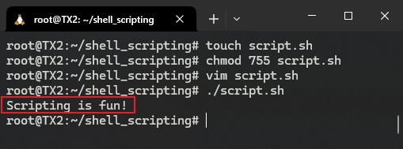
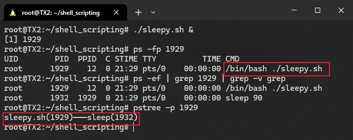
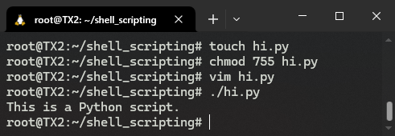

# S02L04: Shell Scripting, Part I（Shell 脚本（一））

> 本节要点
>
> - 脚本的概念
> - 脚本的组成部分
> - 变量在脚本中的用法
> - 脚本中的条件判定与流程控制
> - 命令行参数的接收方法
> - 用户输入内容的接收方法

## 4.1 脚本的概念

主要特点：

- 包含一组命令；
- 这些命令由解释器（interpreter，在 Shell 脚本语境下，即 Shell 自身）负责处理与执行；
- 能在命令行输入的任何内容都可以放到某个脚本中执行；
- 常用于任务的自动化。

例如脚本文件 `script.sh`：

```shell
#!/bin/bash
echo "Scripting is fun!"
```

运行情况如下：



## 4.2 关于 shebang

示例脚本中的数字符号 `#` 与音乐中的升调符号类似，读作 `sharp`（即 `/ʃɑːp/`）；而感叹号 `!` 也有人读作 `/bæŋ/`。因此 `#!` 连起来可以读作 `/ˈʃɑːpˈbæn/`，而平时常见的 `shebang`（`/ʃɪˈbæŋ/`）则是 `sharp bang` 的非标准缩略形式。

`shebang` 的后面要紧跟一个解释器的路径，表示使用该路径对应的解释器来执行这段 Shell 脚本；在执行过程中，该解释器路径 **还会作为参数传给解释器**。验证如下：

> **验证：`shebang` 标记后的解释器路径将作为参数传入该解释器**
>
> 准备一个示例脚本文件 `sleepy.sh`，实现让系统暂时休眠 90 秒：
>
> ```shell
> #!/bin/bash
> sleep 90
> ```
>
> 然后执行以下命令：
>
> ```shell
> $ ./sleepy.sh &
> [1] 1929
> $ ps -fp 1929
> UID        PID  PPID  C STIME TTY          TIME CMD
> root      1929    12  0 21:29 pts/0    00:00:00 /bin/bash ./sleepy.sh
> ```
>
> 可以看到最后一行末尾显示的完整命令为 `/bin/bash ./sleepy.sh`。
>
> 此外，还可以进一步查看该进程号，看到当前有且仅有一个被执行的命令 `sleep 90`：
>
> ```shell
> $ ps -ef | grep 1929 | grep -v grep
> root      1929    12  0 21:29 pts/0    00:00:00 /bin/bash ./sleepy.sh
> root      1932  1929  0 21:29 pts/0    00:00:00 sleep 90
> $ pstree -p 1929
> sleepy.sh(1929)───sleep(1932)
> ```
>
> 实测情况（`WSL` 环境下）：
>
> 

如果不写 `shebang` 这行，解释器将使用当前默认的 `Bash Shell`，执行过程中可能因语法不同而出错。因此最好不要抱侥幸心理。

> [!tip]
>
> **注意：解释器路径可能未必是 Bash Shell**
>
> 如题，该路径也可以是其他完全不同的解释器的，例如 `Python` 解释器——
>
> 依次执行以下命令，创建一个可执行的 `Python` 脚本文件 `hi.py`：
>
> ```shell
> $ touch hi.py
> $ chmod 755 hi.py
> $ vim hi.py
> $ ./hi.py
> ```
>
> 其中 `hi.py` 的代码如下：
>
> ```python
> #!/usr/bin/python
> """
> This is a demo for different interpreter path on shebang line
> """
> print("This is a Python script.")
> ```
>
> 实际运行结果：
>
> 


## 4.3 变量

Shell 脚本中的变量可以简单理解成一个具有名称的存储位置。它是以 **名值对（name-value pair）**的形式定义的，具体语法如下：

```shell
VARIABLE_NAME="value"
```

注意：

1. 等号的两边 **不能出现空格或任何空白符号**；
2. 变量名 **区分大小写**；
3. 变量名最佳实践：统一使用 **全大写+下划线** 形式；
4. 调用变量时，使用 `$VARIABLE_NAME` 或 `${VARIABLE_NAME}`，后者用于分隔紧跟在变量名后面的其他内容。

例如：

```shell
#!/bin/bash
MY_SHELL="bash"
echo "I am $MY_SHELLing on my keyboard."
echo "I am ${MY_SHELL}ing on my keyboard."

# 结果：
# I am  on my keyboard.
# I am bashing on my keyboard.
```


### 4.3.1 将命令执行结果赋给某个变量

具体写法（第 2 行）：

```shell
#!/bin/bash
SERVER_NAME=$(hostname)
echo "You are running this script on ${SERVER_NAME}."

# 结果：
# You are running this script on TX2.
```

还有一种过时的老版本写法，用的是反引号：

```shell
SERVER_NAME=`hostname`
```


### 4.3.2 变量名的命名规范

有效的变量名只能包含大小字母、数字和下划线，且不能以数字开头。


## 4.4 条件判定

语法：

```shell
[ condition-to-test-for ]
```

例如判定文件是否存在：

```shell
[ -e /etc/passwd ]
```

存在，则返回 `true`，此时返回码为 `0`；否则返回 `false`，对应返回码 `1`。


### 4.4.1 常见的条件判定操作符

文件操作符：

|  操作符   | 含义                                 |
| :-------: | ------------------------------------ |
| `-d FILE` | `FILE` 为某个目录，返回 `true`       |
| `-e FILE` | `FILE` 存在，返回 `true`             |
| `-f FILE` | `FILE` 存在且为普通文件，返回 `true` |
| `-s FILE` | `FILE` 存在且非空，返回 `true` [^1]  |
| `-r FILE` | `FILE` 当前可读，返回 `true`         |
| `-w FILE` | `FILE` 当前可写，返回 `true`         |
| `-x FILE` | `FILE` 当前可执行，返回 `true`       |

字符串操作符：

|        操作符        | 含义                                       |
| :------------------: | ------------------------------------------ |
|     `-z STRING`      | `STRING` 为空，返回 `true`                 |
|     `-n STRING`      | `STRING` 非空，返回 `true`                 |
| `STRING1 = STRING2`  | `STRING1` 与 `STRING2` 相等，返回 `true`   |
| `STRING1 != STRING2` | `STRING1` 与 `STRING2` 不相等，返回 `true` |

算术操作符：

|     操作符      | 含义                                  |
| :-------------: | ------------------------------------- |
| `arg1 -eq arg2` | `arg1` 等于 `arg2`，返回 `true`       |
| `arg1 -ne arg2` | `arg1` 不等于 `arg2`，返回 `true`     |
| `arg1 -lt arg2` | `arg1` 小于 `arg2`，返回 `true`       |
| `arg1 -le arg2` | `arg1` 小于或等于 `arg2`，返回 `true` |
| `arg1 -gt arg2` | `arg1` 大于 `arg2`，返回 `true`       |
| `arg1 -ge arg2` | `arg1` 大于或等于 `arg2`，返回 `true` |

更多判定条件的写法，运行 `help test` 或者 `man test | less` 查看具体文档。


---

[^1]: 这里的 `s` 即 `size`，表示文件的大小：若文件存在但大小为 0，则返回 `false`；反之亦然。