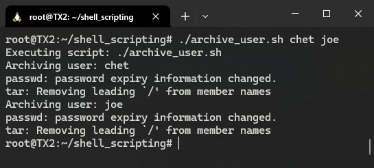
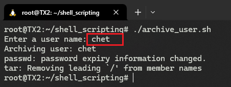

# S02L05: Shell Scripting, Part II（Shell脚本（二））


## 5.1 流程控制—— if 语句

### 语法1：普通型

```shell
if [ condition-is-true ]
then
  command 1
  command 2
  command N
fi
```

注意：方括号内部与判定条件之间至少要有一个空格，否则报错。例如：

```shell
#!/bin/bash
MY_SHELL="bash"

if [ "$MY_SHELL" = "bash" ]
then
  echo "You seem to like the bash shell."
fi

# Output:
# You seem to like the bash shell.
```

最佳实践：在进行条件判定时，**要用引号包裹变量**，以免出现意外情况。例如，运行以下测试脚本 `test.sh`：

```shell
#!/bin/bash
NAME="John Doe"

if [ $NAME = "John Doe" ]; then
    echo "Hello, John!"
fi

# Output:
# ./test.sh: line 4: [: too many arguments
```


### 语法2：`if/else` 型

```shell
if [ condition-is-true ]
then
  command N
else
  command N
fi
```

例如：

```shell
#!/bin/bash
MY_SHELL="csh"

if [ "$MY_SHELL" = "bash" ]
then
  echo "You seem to like the bash shell."
else
  echo "You don't seem to like the bash shell."
fi

# Output:
# You don't seem to like the bash shell.
```


### 语法3：`if/elif/else` 型

`elif` 即表示 `else if`，语法格式如下：

```shell
if [ condition-is-true ]
then
  command N
elif [ condition-is-true ]
then
  command N
else
  command N
fi
```

例如：

```shell
#!/bin/bash
MY_SHELL="csh"

if [ "$MY_SHELL" = "bash" ]
then
  echo "You seem to like the bash shell."
elif [ "$MY_SHELL" = "csh" ]
then
  echo "You seem to like the csh shell."
else
  echo "You don't seem to like the bash or csh shell."
fi

# Output:
# You seem to like the csh shell.
```


## 5.2 流程控制—— for 循环

语法：

```shell
for VARIABLE_NAME in ITEM_1 ITEM_N
do
  command 1
  command 2
  command N
done
```

例如：

```shell
#!/bin/bash

for COLOR in red green blue
do
  echo "COLOR: $COLOR"
done

# Output:
# COLOR: red
# COLOR: green
# COLOR: blue
```

或者将列表项赋给一个变量：

```shell
#!/bin/bash
COLORS="red green blue"

for COLOR in $COLORS
do
  echo "COLOR: $COLOR"
done
```

再如，批量重命名脚本 `rename-pics.sh`：

```shell
#!/bin/bash
PICTURES=$(ls *jpg)
DATE=$(date +%F)

for PICTURE in $PICTURES
do
  echo "Renaming ${PICTURE} to ${DATE}-${PICTURE}"
  mv ${PICTURE} ${DATE}-${PICTURE}
done
```

将其放入一个图片文件夹 `pics` 内，执行以下命令：

```bash
$ mkdir pics
$ cp ./rename-pics.sh ./pics/
$ cd pics
$ touch {bear,man,pig}.jpg
$ ls
bear.jpg  man.jpg  pig.jpg  rename-pics.sh
$ ./rename-pics.sh
Renaming bear.jpg to 2025-08-23-bear.jpg
Renaming man.jpg to 2025-08-23-man.jpg
Renaming pig.jpg to 2025-08-23-pig.jpg
$ ls
2025-08-23-bear.jpg  2025-08-23-man.jpg  2025-08-23-pig.jpg  rename-pics.sh
```


## 5.3 位置参数

**位置参数（Positional Parameters）** 是一系列特殊的变量，用于接收命令行传递的参数：

```shell
$ script.sh parameter1 parameter2 parameter3
```

其位置参数如下：

- `$0`：即 `"script.sh"`
- `$1`：第一个参数 `"parameter1"`
- `$2` - 第二个参数 `"parameter2"`
- `$3` - 第三个参数 `"parameter3"`
- ...

对于参数超过 9 个的，需要使用大括号：

```shell
echo "第 10 个参数: ${10}"
echo "第 11 个参数: ${11}"
```

获取所有的位置参数，可以使用 `$@`

示例：对当前系统的某个用户数据进行存档，编写 Shell 脚本如下：

```shell
#!/bin/bash

echo "Executing script: $0"
echo "Archiving user: $1"

# Lock the account
passwd -l $1

# Create an archive of the home directory.
tar cf /archives/${1}.tar.gz /home/${1}
```

如果存在用户 `elvis`，则运行结果为：

```sh
$ ./archive_user.sh elvis
Executing script: ./archive_user.sh
Archiving user: elvis
passwd: password expiry information changed.
tar: Removing leading `/' from member names
$ 
```


扩展1：为了增强脚本的可读性，使用变量替换位置参数（L3、L6、L9、L12）：

```shell
#!/bin/bash

USER=$1 # The first parameter is the user.

echo "Executing script: $0"
echo "Archiving user: $USER"

# Lock the account
passwd -l $USER

# Create an archive of the home directory.
tar cf /archives/${USER}.tar.gz /home/${USER}
```

扩展2：如果批量处理多个用户的存档，则重构为 `$@` + `for` 循环结构：

```shell
#!/bin/bash

echo "Executing script: $0"

for USER in $@
do
  echo "Archiving user: $USER"

  # Lock the account
  passwd -l $USER

  # Create an archive of the home directory.
  tar cf /archives/${USER}.tar.gz /home/${USER}
done
```

可能的批量处理如下：

```shell
$ ./archive_user.sh chet joe
Executing script: ./archive_user.sh
Archiving user: chet
passwd: password expiry information changed.
tar: Removing leading `/' from member names
Archiving user: joe
passwd: password expiry information changed.
tar: Removing leading `/' from member names
$ 
```

实测情况（需提前创建测试用户 `chet` 和 `joe`，以及存档文件夹 `/archives`）：




## 5.4 接收用户输入（标准输入）

用户输入内容在 `Shell` 脚本中的标准输入。除了用户输入外，标准输入的来源还可以是命令执行结果，或者通过命令管道操作导入。

用户输入的接收通过 `read` 命令实现，语法格式为：

```shell
read -p "PROMPT" VARIABLE
```

即通过 `-p` 设置提示语，然后将输入内容赋给变量 `VARIABLE`。

再次重构用户存档脚本，将待存档用户列表改造为通过用户输入传给脚本：

```shell
#!/bin/bash

read -p "Enter a user name: " USER
echo "Archiving user: $USER"

# Lock the account
passwd -l $USER

# Create an archive of the home directory.
tar cf /archives/${USER}.tar.gz /home/${USER}
```

实测情况：




## 5.5 本章小结

- `Shell` 脚本的首行：`#!/path/to/interpreter`
- 变量的赋值：
  - `VARIABLE_NAME="value"`
  - `VARIABLE_NAME=$(command)`
- 变量的使用：
  - `$VARIBALE_NAME`
  - `${VARIBALE_NAME}`
- `if` 语句
  - `if-else`
  - `if-elif-else`
- `for` 循环语句
- 位置参数：
  - `$0`, `$1`, `$2` ... `$9`, `${10}`
  - 所有位置参数列表：`$@`
- 注释语句：除首行的 `shebang` 外，其余位置使用 `#`
- 用户输入：使用 `read` 命令