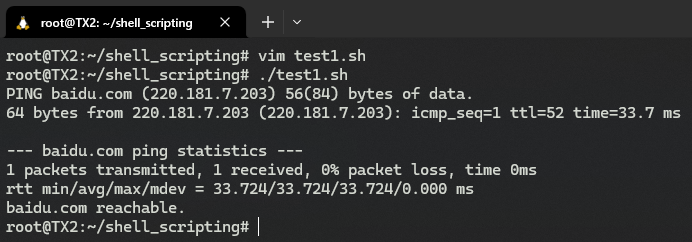

# S02L07: Exit Statuses and Return Codes（退出状态与返回码）

> **本节概要**
>
> - 退出状态的检查方法
> - 基于退出状态的分支决策设计
> - 退出状态的具体应用


## 1 关于退出状态

在 Shell 中，每个命令都会返回一个退出状态（`exit status`），也叫状态码、返回码。

退出状态的取值范围：0 到 255。其中：

- `0` 表示执行成功；
- 不为 `0` 表示存在报错（`error`）；

因此，可以利用它来 **定性地** 检测命令的执行是否存在报错，也可以用于 **定量地**、有针对性地检测具体的报错类型。

例如 `grep` 命令执行查找时，状态码为 `0` 表示查找成功，`1` 表示没找到，`2` 表示存在报错：

```markdown
Normally the exit status is 0 if a line is selected, 1 if no lines were selected, and 2 if an error occurred.  However, if the -q or --quiet or --silent is used and a line is selected, the exit status is 0 even if an error occurred.
```


查看上条命令执行后的退出状态，使用 `$?`：

```shell
ls /not/here
echo "$?" # 2
```

再比如，根据 `ping` 命令的执行情况输出不同的结果：

```shell
HOST="baidu.com"
ping -c 1 $HOST
if [ "$?" -eq "0" ]
then
  echo "$HOST reachable."
else
  echo "$HOST unreachable."
fi
```

注意：这里的参数 `-c 1` 表示只发送一个数据包。

实测结果如下：



略加改动，就是一个检测报错的例子（L3）：

```shell
HOST="baidu.com"
ping -c 1 $HOST
if [ "$?" -ne "0" ]
then
  echo "$HOST unreachable."
fi
```

还有一种常见的做法，是将状态码赋给一个描述性更强的变量（L3）：

```shell
HOST="baidu.com"
ping -c 1 $HOST
RETURN_CODE=$?
if [ "$RETURN_CODE" -ne "0" ]
then
  echo "$HOST unreachable."
fi
```


## 2 逻辑运算及应用

- 与运算：`&&`
- 或运算：`||`

返回码在逻辑运算中的短路实现：

- `COMMAND_1 && COMMAND_2` 仅在 `COMMAND_1` 为真时（即返回码为 `0` 时）执行 `COMMAND_2`：

  ```shell
  mkdir /tmp/bak && cp test.txt /tmp/bak/
  ```

- `COMMAND_1 || COMMAND_2` 仅在 `COMMAND_1` 为假时（即返回码不为 `0` 时）执行 `COMMAND_2`：

  ```shell
  cp test.txt /tmp/bak/ || cp test.txt /tmp
  ```

因此刚才的例子可以简化为：

```shell
#!/bin/bash
HOST="baidu.com"
ping -c 1 $HOST && echo "$HOST reachable."
```

同理，检测失败的例子也可以改造为：

```shell
#!/bin/bash
HOST="baidu.com"
ping -c 1 $HOST || echo "$HOST unreachable."
```

> [!tip]
>
> Shell 脚本中也有类似三目运算符的写法，语法格式为：
>
> ```shell
> [ condition ] && true_value || false_value
> ```
>
> 例如：
>
> ```shell
> #!/bin/bash
> 
> HOST="baidu.com"
> ping -c 1 $HOST
> RESULT=$([ "$?" -eq "0" ] && echo "$HOST reachable." || echo "$HOST unreachable.")
> echo $RESULT
> ```
>
> 但是有个陷阱：当 `&&` 后面的部分为空或执行失败，同样会触发 `||` 后面的逻辑：
>
> ```shell
> # Error demo
> result=$([ condition ] && "" || "false")  # 这样总是返回 "false"
> ```
>
> 因此，对于复杂逻辑，最好还是用 `if-else` 语句。


## 3 一行执行多条命令

使用分号 `;` 分隔同一行的多条命令。


## 4 关于 exit 命令

用于手动指定返回码：

```shell
exit 0
exit 1
exit 2
exit 255
```

一旦执行 `exit` 命令，Shell 脚本便停止执行。

如果不显式声明，默认情况下，最后一条命令的返回码即为整个 Shell 脚本的返回码。

例如 `exit-status-06.sh`：

```shell
#!/bin/bash

HOST="baidu.com"

ping -c 1 $HOST

if [ "$?" -ne "0" ]
then
  echo "$HOST unreachable."
  exit 1
fi

exit 0
```

此时，调用脚本 `exit-status-06.sh` 后的状态码，就和调用其他命令的状态码是一个效果了。基于这个原理，就可以根据需要设置不同的返回码，设计出更复杂的脚本逻辑。


## 5 小结

- 所有命令都会返回一个 **退出状态（*exit status*）**
- 退出状态的取值范围为 `0` 到 `255`，`0` 表示执行成功，其余表示存在报错
- 用 `$?` 查看退出状态的值
- 灵活运用 `if`、`&&`、`||` 处理分支逻辑
- 用 `exit` 命令手动设置返回码
