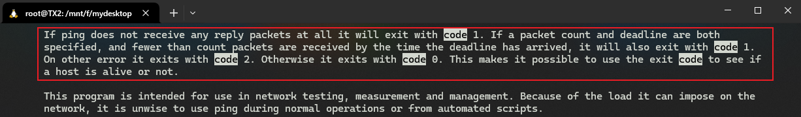

# S02L07: Exit Status Demo（退出状态练习）


## 1 ping 命令的状态码

发送一个数据包到百度：

```shell
$ ping -c 1 baidu.com
PING baidu.com (39.156.70.37) 56(84) bytes of data.
64 bytes from 39.156.70.37 (39.156.70.37): icmp_seq=1 ttl=49 time=36.7 ms

--- baidu.com ping statistics ---
1 packets transmitted, 1 received, 0% packet loss, time 0ms
rtt min/avg/max/mdev = 36.658/36.658/36.658/0.000 ms
$ echo $?
0
```

限制过期时间：

```shell
$ ping -c 1 -w 1 baidu.com
PING baidu.com (39.156.70.37) 56(84) bytes of data.

--- baidu.com ping statistics ---
1 packets transmitted, 0 received, 100% packet loss, time 0ms
$ echo $?
1
```

存在报错的情况：

```shell
$ ping -c 1 -w 1 baidu.con
ping: baidu.con: Name or service not known
$ echo $?
2
```

查看 `ping` 命令的文档，了解具体的状态码含义：

```shell
$ man ping | less
# 检索 code 定位到状态码相关位置
```

实测效果：



> [!note]
>
> 注意：`-w 1` 中的时间单位是秒，且不能使用小数。


## 2 逻辑与运算符的用法练习

前一个中断，后一个不执行：

```shell
$ mkdir /tmp/anton/bak && cp -v /etc/hosts /tmp/anton/bak
mkdir: cannot create directory ‘/tmp/anton/bak’: No such file or directory
$ echo $?
1
```

前一个正常，后一个才执行：

```shell
$ mkdir -p /tmp/anton/bak && cp -v /etc/hosts /tmp/anton/bak
'/etc/hosts' -> '/tmp/anton/bak/hosts'
$ echo $?
0
```

注：`cp -v` 中的 `-v` 是展示操作详情（`verbose`）的意思，以便进一步佐证命令是否被执行。


## 3 逻辑或运算符的用法练习

前一个报错，后一个才执行：

```shell
$ cp -v /etc/hosts /tmp/bak/ || cp -v /etc/hosts /tmp/anton/bak
cp: failed to access '/tmp/bak/': Not a directory
'/etc/hosts' -> '/tmp/anton/bak/hosts'
$ echo $?
0
```

前一个正常，后一个不执行：

```shell
$ cp -v /etc/hosts /tmp/bak/ || cp -v /etc/hosts /tmp/anton/bak
'/etc/hosts' -> '/tmp/bak'
$ echo $?
0
```


## 4 分号的用法

前一个命令报错与否，都不影响后面命令的执行：

```shell
$ ls /etc/linux-release ; hostname
ls: cannot access '/etc/linux-release': No such file or directory
TX2
$ ls /etc/hosts ; hostname
/etc/hosts
TX2
```

利用分号串联多个命令：

```shell
$ ls /etc/hosts; hostname; uptime
/etc/hosts
TX2
 16:57:59 up  1:09,  0 users,  load average: 0.00, 0.00, 0.00
```

